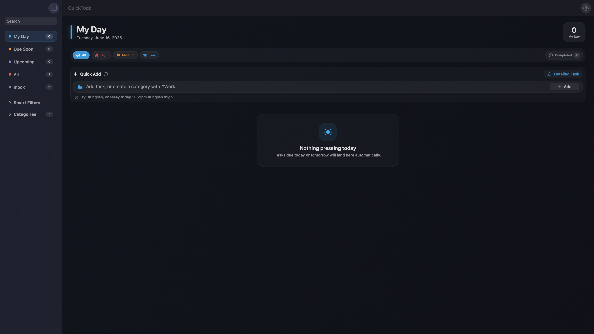
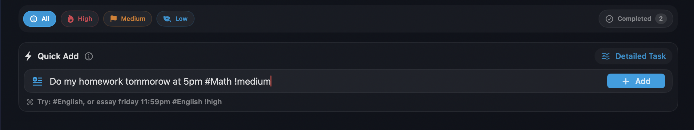
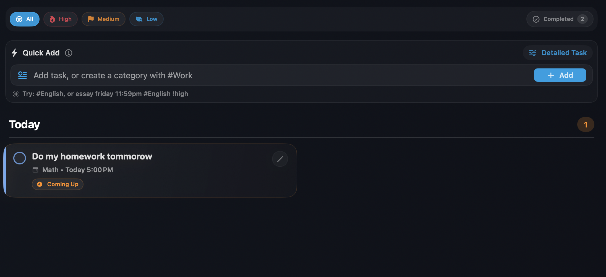
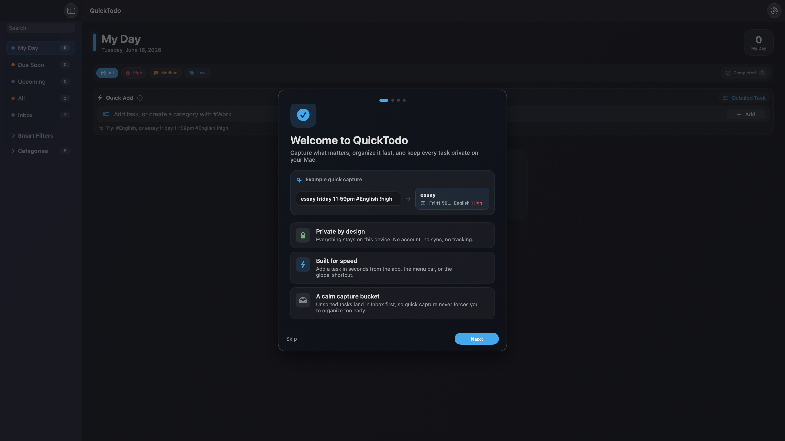

# QuickTodo

QuickTodo is a macOS task app I built to make capturing and organizing tasks feel fast, clean, and simple.

The goal is not to create another complicated productivity system. QuickTodo is meant to be the kind of app you can open, type what you need to do, and keep moving. It supports quick task entry, categories, reminders, subtasks, local notifications, and a menu bar quick-add tool for capturing tasks without breaking your flow.

The app is built with SwiftUI and SwiftData, and everything is stored locally on the Mac.

---

## What QuickTodo Does

QuickTodo helps you quickly create and manage tasks using natural language.

For example, you can type:

```text
Pay rent tomorrow 9am #Personal
Essay friday 11:59pm #English !high
Call mom in 10 minutes
Submit report June 15th at 10pm #Work
```

QuickTodo can recognize due dates, times, categories, and priority levels from the text you type.

---

## Main Features

* Quick task capture
* Natural language date and time parsing
* Categories and custom category colors
* Priority levels
* Due dates and reminders
* Local macOS notifications
* Subtasks/checklists
* Smart sidebar filters
* Menu bar quick-add
* Global hotkey support
* Onboarding and help screens
* Local storage with SwiftData

---

## Sidebar Views

QuickTodo includes several built-in views to help organize tasks:

* My Day
* Due Soon
* Upcoming
* All Tasks
* Inbox
* No Date
* High This Week
* Done This Week
* Custom categories

The idea is to keep the app flexible without making it feel crowded.

---

## Notifications and Reminders

Tasks with due dates can send local macOS notifications.

Reminder options include:

* 5 minutes before
* 10 and 5 minutes before
* 30, 10, and 5 minutes before
* Custom reminder times

Notifications also support quick actions like marking a task done or snoozing it.

---

## Menu Bar Quick Add

QuickTodo includes a menu bar quick-add window so you can add a task without fully opening the app.

There is also a global hotkey:

```text
Control + Option + Command + Space
```

This lets you capture a task from anywhere on your Mac.

---

## Privacy

QuickTodo is local-first.

There are no accounts, no external servers, and no required cloud connection. Task data stays on the user’s Mac.

---

## Screenshots

### Main Dashboard



### Quick Add




### Settings


### Help Screen


### Onboarding



## Built With

* Swift
* SwiftUI
* SwiftData
* AppKit
* UserNotifications
* AVFoundation
* ServiceManagement

---

## Requirements

* macOS 14 or later
* Xcode 15 or later

---

## Running the App

1. Clone or download this repository.
2. Open the project in Xcode.
3. Open the `.xcodeproj` file.
4. Build and run the app.
5. Allow notification permissions if you want reminders to work.

---

## Current Status

QuickTodo is an active macOS app project. The current version focuses on building a polished local task manager with fast capture, a clean interface, smart organization, and native macOS behavior.

---

## Possible Future Updates

Some features I may add later:

* Recurring tasks
* Calendar integration
* iCloud sync
* More natural language options
* Custom keyboard shortcuts
* Widgets
* Task templates
* Import/export tools

---

## License

This project is currently private/proprietary unless otherwise stated.
